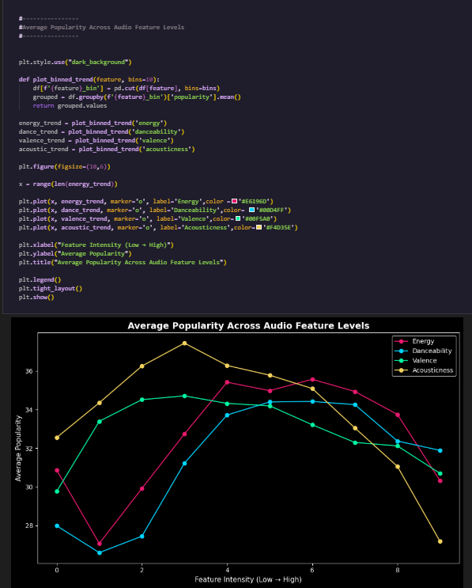
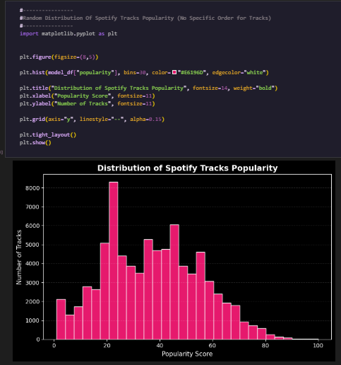
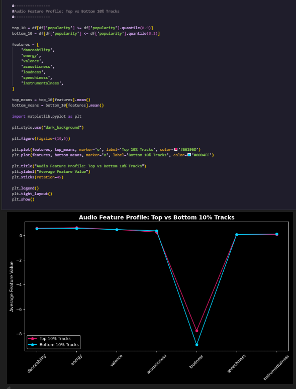

# spotify-popularity-analysis

Exploratory data analysis of Spotify tracks to understand how audio features relate to song popularity.

This project explores how Spotify audio features relate to track popularity.

## Objectives
- Analyze relationships between audio features and popularity
- Identify nonlinear patterns in feature behavior
- Compare top performing tracks vs low performing tracks

## Dataset
Spotify track dataset (~80k tracks after cleaning)

## Visualization and Interpretation
# Average Popularity Across Audio Feature Levels

This visualization explores how track popularity changes as the intensity of different audio features increases.

Features analyzed:

- Energy

- Danceability

- Valence (positiveness)

- Acousticness

Interpretation

- Energy: Popularity increases with moderate energy but drops at extremely high energy levels.

- Danceability: Songs with higher danceability tend to achieve higher popularity.

- Valence: Moderately positive songs perform better than extremely sad or extremely happy songs.

- Acousticness: Highly acoustic songs tend to have lower popularity, suggesting mainstream tracks favor produced sounds.

Key insight:
Moderate levels of energy and emotional balance tend to correlate with higher popularity.
-
# Distribution of Spotify Track Popularity

This histogram visualizes the overall distribution of popularity scores across all tracks in the dataset.

Interpretation

- Most songs fall between 20–60 popularity score.

- Very few songs reach extremely high popularity (>80).

- The distribution is right-skewed, meaning blockbuster hits are rare.

- This confirms that most tracks perform moderately rather than becoming major hits.

Key insight:
Most songs on Spotify achieve moderate popularity scores (roughly between 20–60), while extremely high-popularity tracks are relatively rare. This indicates that viral or blockbuster hits represent only a small fraction of all released music, suggesting that success on streaming platforms is concentrated among a limited number of tracks while the majority perform at average levels.
-
# Audio Feature Profile: Top 10% vs Bottom 10% Tracks

This comparison highlights the average audio feature values for:

* Top 10% most popular tracks

* Bottom 10% least popular tracks

Features compared:

- Danceability

- Energy

- Valence

- Acousticness

- Loudness

- Speechiness

- Instrumentalness

Interpretation

Key differences observed:

- Top tracks are generally louder

- Higher danceability is associated with popularity

- Less acoustic and less instrumental songs perform better

- Speechiness shows minimal impact

Key insight:
Hit songs tend to be loud, energetic, and danceable, aligning with mainstream listening preferences.
-
# Top 10 Genres by Average Popularity

What this chart shows

This bar chart ranks genres based on their average popularity score.

Top performing genres include:

- K-Pop

- Pop Film

- Metal

- Latin

- Soul

- EDM

- Electro

- Pop

- Chill

- House

- Interpretation

K-Pop leads the popularity rankings, reflecting its strong global fanbase.

Electronic and dance-focused genres dominate the top rankings.

Traditional or acoustic-heavy genres appear less frequently among the most popular.

Key insight:
Modern streaming audiences strongly favor danceable and high-energy genres.
-

# Danceability: High vs Low Popularity Tracks

What this chart shows

This box plot compares the danceability scores of:

- Highly popular songs

- Less popular songs

Interpretation

- High popularity songs tend to have slightly higher median danceability.

However, the distributions overlap significantly.

Key insight:
Danceability contributes to popularity but is not a decisive factor alone.
-

# Energy: High vs Low Popularity Tracks

What this chart shows

This plot compares energy levels between high-popularity and low-popularity tracks.

Interpretation

- Popular songs generally have moderately high energy levels.

- Extremely low-energy songs are less common among hits.

Key insight:
Listeners appear to prefer energetic tracks, but extreme energy levels are not necessary for success.
-
# Acousticness: High vs Low Popularity Tracks

What this chart shows

This box plot compares acousticness scores between high-popularity and low-popularity tracks.

Interpretation

- Low popularity tracks tend to show higher acousticness.

- Highly popular songs generally have lower acousticness values.

Key insight:
Mainstream hits tend to rely more on produced, electronic, or studio-enhanced sounds rather than purely acoustic compositions.
-
# Speechiness: High vs Low Popularity Tracks

What this chart shows

This plot compares speech-like audio elements between popular and less popular songs.

Interpretation

- Both groups show very low median speechiness values.

- Songs with extremely high speechiness are rare.

Key insight:
Speech-heavy tracks (talking or spoken-word style) are not typical among popular songs.
-
# Feature Correlation Matrix

What this chart shows

This heatmap displays correlations between audio features and popularity.

Key relationships

Energy and Loudness show strong positive correlation.

Acousticness is negatively correlated with Energy and Loudness.

Danceability moderately correlates with Valence.

Important finding

Popularity shows very weak direct correlations with most features.

Key insight:
No single audio feature strongly predicts popularity — hit songs likely emerge from a combination of characteristics rather than one dominant factor.
-
# Popularity Across Energy × Danceability

What this chart shows

This heatmap visualizes how combinations of energy and danceability levels influence track popularity.

Interpretation

Highest popularity appears in moderately high energy and danceability combinations.

Extremely low energy tracks tend to perform poorly.

Balanced combinations produce the best results.

Key insight:
Successful songs often balance danceability and energy rather than maximizing one feature alone.
-

## Machine Learning Model
# Hit Song Prediction Model

A classification model was built to predict whether a track is a hit or not based on audio features.

Model Performance

Accuracy: ~95%

ROC-AUC Score: ~0.69

However, the confusion matrix shows the model predicts non-hit songs much better than hit songs, indicating class imbalance.

# Feature Importance for Predicting Hits

Most influential features in predicting hit songs:

Instrumentalness

Acousticness

Energy

Loudness

Duration

Danceability

Valence

Speechiness

Tempo

Interpretation

Songs with lower instrumentalness tend to be more popular.

Energy and loudness significantly contribute to hit probability.

Danceability also plays a meaningful role.

Key insight:
Hit songs often combine produced sound, strong energy, and rhythmic danceability.
-
## Analysis Performed
- Data cleaning
- Feature distribution analysis
- Correlation heatmaps
- Nonlinear feature bin analysis
- Feature interaction heatmap
- Top vs Bottom 10% comparison

## Key Insights
- Audio features show weak linear correlation with popularity.
- Popular tracks tend to lie in moderate ranges of energy and danceability.
- Extremely high or low feature intensities underperform.
- External factors (marketing, playlist placement, timing) likely play a major role in popularity.

## Tools Used
- Python
- Pandas
- Matplotlib
- Jupyter Notebook
- SciKitLearn
