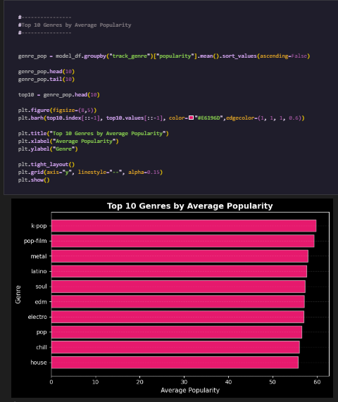
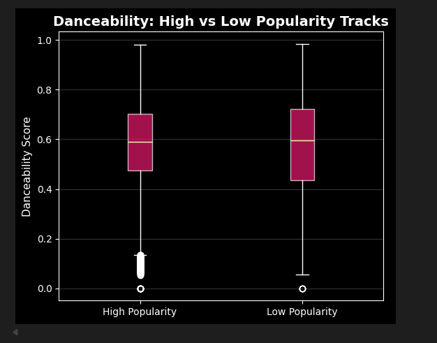
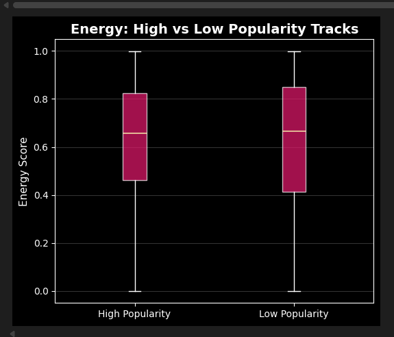
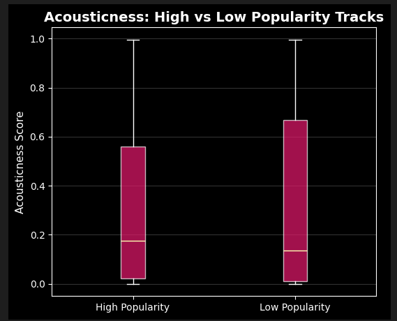
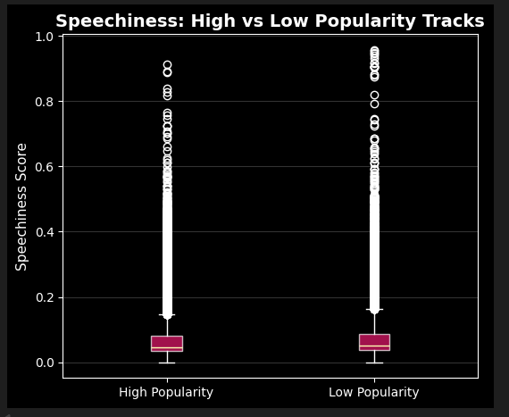
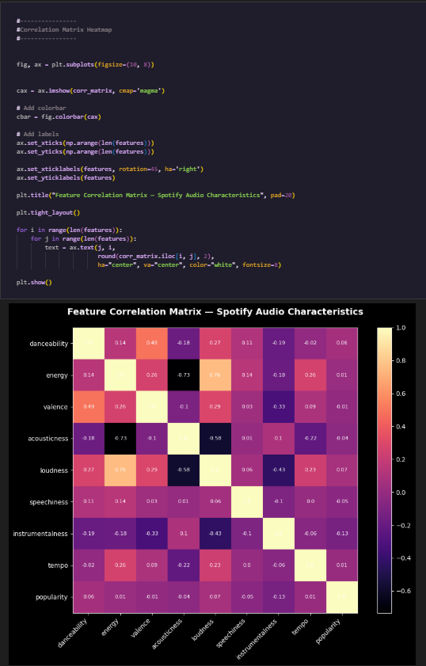
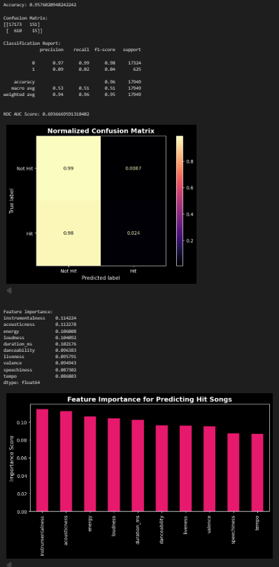

# :musical_note: spotify-popularity-analysis

Exploratory Data Analysis and Machine Learning on Spotify tracks to understand how audio features influence song popularity.

This project analyzes Spotify audio features and applies machine learning techniques to explore patterns and predict track popularity.

## :pushpin: Objectives
- Analyze relationships between audio features and popularity
- Identify nonlinear patterns in feature behavior
- Compare top performing tracks vs low performing tracks

## :chart_with_upwards_trend: Dataset
Spotify track dataset (~80k tracks after cleaning)

Data Cleaning & Transformation

Before performing any visualization or model building, the dataset was preprocessed to improve data quality and ensure reliable results.

1. Handling Missing Values

Missing or incomplete values were identified and removed or appropriately handled to avoid inaccurate analysis and model bias.

2. Removing Duplicates

Duplicate song records were checked and removed to maintain dataset consistency and prevent repeated observations from affecting predictions.

3. Data Type Corrections

Columns were converted into proper formats where required (numerical, categorical, date/time) to ensure compatibility with analysis tools.

4. Feature Selection

Only relevant columns such as audio features and popularity indicators were selected for analysis, while unnecessary identifiers or redundant fields were excluded.

## :bar_chart: Visualization and Interpretation
# :bar_chart: Average Popularity Across Audio Feature Levels

This visualization explores how track popularity changes as the intensity of different audio features increases.

Features analyzed:

- Energy

- Danceability

- Valence (positiveness)

- Acousticness

Interpretation

- Energy: Popularity increases with moderate energy but drops at extremely high energy levels.

- Danceability: Songs with higher danceability tend to achieve higher popularity.

- Valence: Moderately positive songs perform better than extremely sad or extremely happy songs.

- Acousticness: Highly acoustic songs tend to have lower popularity, suggesting mainstream tracks favor produced sounds.

Key insight:
Moderate levels of energy and emotional balance tend to correlate with higher popularity.
-
# :arrow_double_up: Distribution of Spotify Track Popularity

This histogram visualizes the overall distribution of popularity scores across all tracks in the dataset.

Interpretation

- Most songs fall between 20–60 popularity score.

- Very few songs reach extremely high popularity (>80).

- The distribution is right-skewed, meaning blockbuster hits are rare.

- This confirms that most tracks perform moderately rather than becoming major hits.

Key insight:
Most songs on Spotify achieve moderate popularity scores (roughly between 20–60), while extremely high-popularity tracks are relatively rare. This indicates that viral or blockbuster hits represent only a small fraction of all released music, suggesting that success on streaming platforms is concentrated among a limited number of tracks while the majority perform at average levels.
-
# :keycap_ten: Audio Feature Profile: Top 10% vs Bottom 10% Tracks

This comparison highlights the average audio feature values for:

* Top 10% most popular tracks

* Bottom 10% least popular tracks

Features compared:

- Danceability

- Energy

- Valence

- Acousticness

- Loudness

- Speechiness

- Instrumentalness

Interpretation

Key differences observed:

- Top tracks are generally louder

- Higher danceability is associated with popularity

- Less acoustic and less instrumental songs perform better

- Speechiness shows minimal impact

Key insight:
Hit songs tend to be loud, energetic, and danceable, aligning with mainstream listening preferences.
-
# :keycap_ten: Top 10 Genres by Average Popularity

This bar chart ranks genres based on their average popularity score.

Top performing genres include:

- K-Pop

- Pop Film

- Metal

- Latin

- Soul

- EDM

- Electro

- Pop

- Chill

- House

- Interpretation

K-Pop leads the popularity rankings, reflecting its strong global fanbase.

Electronic and dance-focused genres dominate the top rankings.

Traditional or acoustic-heavy genres appear less frequently among the most popular.

Key insight:
Modern streaming audiences strongly favor danceable and high-energy genres.
-

# :dancer: Danceability: High vs Low Popularity Tracks

This box plot compares the danceability scores of:

- Highly popular songs

- Less popular songs

Interpretation

- High popularity songs tend to have slightly higher median danceability.

However, the distributions overlap significantly.

Key insight:
Danceability contributes to popularity but is not a decisive factor alone.
-

# :star: Energy: High vs Low Popularity Tracks

This plot compares energy levels between high-popularity and low-popularity tracks.

Interpretation

- Popular songs generally have moderately high energy levels.

- Extremely low-energy songs are less common among hits.

Key insight:
Listeners appear to prefer energetic tracks, but extreme energy levels are not necessary for success.
-
# :notes: Acousticness: High vs Low Popularity Tracks

This box plot compares acousticness scores between high-popularity and low-popularity tracks.

Interpretation

- Low popularity tracks tend to show higher acousticness.

- Highly popular songs generally have lower acousticness values.

Key insight:
Mainstream hits tend to rely more on produced, electronic, or studio-enhanced sounds rather than purely acoustic compositions.
-
# 🎤 Speechiness: High vs Low Popularity Tracks

This plot compares speech-like audio elements between popular and less popular songs.

Interpretation

- Both groups show very low median speechiness values.

- Songs with extremely high speechiness are rare.

Key insight:
Speech-heavy tracks (talking or spoken-word style) are not typical among popular songs.
-
# ❗Feature Correlation Matrix

This heatmap displays correlations between audio features and popularity.

Key relationships

- Energy and Loudness show strong positive correlation.

- Acousticness is negatively correlated with Energy and Loudness.

- Danceability moderately correlates with Valence.

Important finding

Popularity shows very weak direct correlations with most features.

Key insight:
No single audio feature strongly predicts popularity — hit songs likely emerge from a combination of characteristics rather than one dominant factor.
-
# :bangbang: Popularity Across Energy × Danceability

This heatmap visualizes how combinations of energy and danceability levels influence track popularity.

Interpretation

- Highest popularity appears in moderately high energy and danceability combinations.

- Extremely low energy tracks tend to perform poorly.

- Balanced combinations produce the best results.

Key insight:
Successful songs often balance danceability and energy rather than maximizing one feature alone.
-

## Machine Learning Model
# :file_folder: Hit Song Prediction Model

Spotify Hit Song Prediction – Model Evaluation & Insights

This machine learning project was developed to predict whether a Spotify track would be classified as a Hit or Not Hit using audio-based features such as energy, loudness, danceability, acousticness, tempo, speechiness, valence, and duration.

Model Accuracy

The model achieved an overall accuracy of 95.76%, which indicates strong general predictive performance across the dataset. This means the model correctly classified the majority of songs into their respective categories.

However, because the dataset contained significantly more Not Hit songs than Hit songs, accuracy alone does not fully reflect the model’s ability to detect successful tracks.

Confusion Matrix Analysis

The confusion matrix showed that the model performed exceptionally well in identifying Not Hit songs, correctly predicting most of them with very few false positives.

At the same time, the model had difficulty identifying actual Hit songs, misclassifying many of them as Not Hits. This suggests a class imbalance issue, where the model became more biased toward the majority class.

Business Interpretation:
Strong at filtering songs unlikely to succeed.
Weaker at discovering breakout or viral songs early.
Classification Report
Class 0 – Not Hit Songs
High precision and recall
Reliable and consistent predictions
Class 1 – Hit Songs
Lower precision and recall
Many hit songs were missed

This indicates that while the model is accurate overall, it is conservative when predicting hits.

ROC-AUC Score

The model achieved an ROC-AUC Score of approximately 0.63.

ROC-AUC measures how well the model separates the two classes across different probability thresholds:

0.50 = Random guessing
0.60 – 0.70 = Moderate discrimination
0.70+ = Strong model performance

A score of 0.63 suggests that the model has some ability to distinguish hits from non-hits, but there is room for improvement in classification quality.

Feature Importance

The most important features influencing predictions were:

-Instrumentalness
-Acousticness
-Energy
-Loudness
-Duration
-Danceability
-Liveness
-Valence
-Speechiness
-Tempo

This suggests that production style, sound intensity, structure, and listener engagement characteristics had the greatest impact on hit prediction.

Clustering Insight

Clustering techniques were also used to group songs with similar audio characteristics. This helped identify natural song segments within the dataset, such as:

High-energy commercial tracks
Acoustic / mellow songs
Dance-focused tracks
Speech-heavy or experimental tracks

These clusters provide useful insight into how songs are distributed stylistically and can support recommendation systems, audience targeting, and trend analysis.

A classification model was built to predict whether a track is a hit or not based on audio features.

Model Performance

- Accuracy: ~95%

- ROC-AUC Score: ~0.69

However, the confusion matrix shows the model predicts non-hit songs much better than hit songs, indicating class imbalance.

Interpretation

Songs with lower instrumentalness tend to be more popular.

Energy and loudness significantly contribute to hit probability.

Danceability also plays a meaningful role.

Key insight:
Hit songs often combine produced sound, strong energy, and rhythmic danceability.
-
## Analysis Performed
- Data cleaning
- Feature distribution analysis
- Correlation heatmaps
- Nonlinear feature bin analysis
- Feature interaction heatmap
- Top vs Bottom 10% comparison

## Key Insights
- Audio features show weak linear correlation with popularity.
- Popular tracks tend to lie in moderate ranges of energy and danceability.
- Extremely high or low feature intensities underperform.
- External factors (marketing, playlist placement, timing) likely play a major role in popularity.

## Tools Used
- Python 
- Pandas 
- Matplotlib 
- Jupyter Notebook 
- SciKitLearn 
